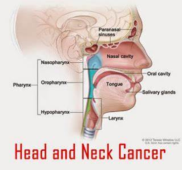

```{r setup, include=FALSE}
knitr::opts_chunk$set(echo = TRUE)
library(ggplot2)
library(ggpubr)
theme_set(theme_pubr())
library(png)
```
# General Introduction
Head and neck cancer is defined as a group of cancers, concerning the mouth, nose and throat. With over 90%, Squamous cell carcinoma is the most common type in HNC patients.With 5.5 million affected people in 2015 it is the seventh most frequent cancer and the ninth most frequent cause of death. (Information required)



In the century of next generation sequencing, the genome became an interesting target for scientists.Approaches that directly affect important oncogenes often fail due to the fact that these genes play an improtant role in healthy cells.The researchers in our paper investigated synthetic lethality and synthetic dosage letahlity that uses gene interactions to affect tumorous proliferation. Synthetic letahlity is a gene interaction in which single-gene defects
are compatible with cell viability, but the combination of gene effects results in cell death.Synthetic dosage lethality occurs, when the overexpression of one gene is combined with the knockout of another gene.


# 1. Data Cleanup & Descriptive Statistics

## Loading data and defining HNC variables
```{r}
# Load dataset
allDepMapData = readRDS("DepMap19Q1_allData.RDS")

# Creation of sub matrices
expression = allDepMapData[["expression"]]
copynumber = allDepMapData[["copynumber"]]
mutation = allDepMapData[["mutation"]]
kd.ceres = allDepMapData[["kd.ceres"]]
kd.prob = allDepMapData[["kd.prob"]]
annotation = allDepMapData[["annotation"]]
rm(allDepMapData)

# Reducing the samples to head and neck cancer samples
annotation.HNC = annotation[which(annotation$Primary.Disease == "Head and Neck Cancer"), ]
ID = annotation.HNC$DepMap_ID

# Filtering of sub matrices by primary disease "Head and neck cancer"
expression.HNC = expression[ , which(colnames(expression) %in% ID)]
copynumber.HNC = copynumber[ , which(colnames(copynumber) %in% ID)]
kd.ceres.HNC = kd.ceres[ , which(colnames(kd.ceres) %in% ID)]
kd.prob.HNC = kd.prob[ , which(colnames(kd.prob) %in% ID)]
mutation.HNC = mutation[ID]
```

## Expression analysis

### Checking fo NAs
```{r}
sum(is.na(expression) == TRUE)
```

### Comparing mean gene expression of all samples with just HNC samples
```{r}
expression.reference = expression[ , -which(colnames(expression) %in% ID)]
mean.exp.reference = apply(expression.reference, 1, mean)
mean.exp.HNC = apply(expression.HNC, 1, mean)

# Checking if expression is normally distributed
HNC = data.frame(expression_values = mean.exp.HNC, sample = "HNC")
reference = data.frame(expression_values = mean.exp.reference, sample = "reference")
mean.expression = rbind(reference, HNC)

ggqqplot(mean.expression, x = "expression_values",
   color = "sample",
   palette = c("#FC4E07", "#0073C2FF"),
   ggtheme = theme_pubclean())

rm(HNC, reference, mean.expression)
```
Result: Gene espression is not normally distributed.
```{r}
# Applying Wilcoxon rank sum test because expression is not normally distributed
wilcox.test(mean.exp.HNC, mean.exp.reference)
```
Result: Mean gene expression differs between HNC samples and all samples significantly.

### Comparing mean TP53 gene expression of all samples with and without deleterious TP53 mutation
```{r}
mutation.df = do.call(rbind, mutation)
TP53.mut.ID = mutation.df[which(mutation.df$Hugo_Symbol == "TP53" & mutation.df$isDeleterious == TRUE), ]$DepMap_ID
TP53.norm.ID = annotation$DepMap_ID[-which(annotation$DepMap_ID %in% TP53.mut.ID)]
exp.TP53.mut = as.numeric(expression["TP53", TP53.mut.ID])
exp.TP53.norm = as.numeric(expression["TP53", TP53.norm.ID])

# Applying Wilcoxon rank sum test because expression is not normally distributed
wilcox.test(exp.TP53.mut , exp.TP53.norm)

rm(TP53.mut.ID, TP53.norm.ID, exp.TP53.mut, exp.TP53.norm)
```
Result: Gene expression of varies significantly whether the samples has or has no a deleterious TP53 mutation.

### Checking how the expression values are distributed
```{r}
expression.values = data.frame(expression_value = mean.exp.HNC)
# density plot
ggdensity(expression.values, x = "expression_value", xlab = "expression value",
          fill = "#0073C2FF", color = "#0073C2FF",
          add = "mean", rug = TRUE)
# histogram
gghistogram(expression.values, x = "expression_value", xlab = "expression value", bins = 60,
            fill = "#0073C2FF", color = "#0073C2FF",
            add = "mean", rug = TRUE)

rm(expression.values)
```
### Plotting the 25 most under- and overexpressed genes of the first sample
```{r}
expr.HNC.norm = apply(expression.HNC, 2, function(x) {
    x - mean.exp.reference
})
expr.HNC.norm = as.data.frame(expr.HNC.norm)
sample1 = data.frame(Genes=rownames(expr.HNC.norm),Values=expr.HNC.norm$`ACH-000188`)
sample1$Group<-ifelse(sample1$Values>0,"overexpressed","underexpressed")
l = quantile(expr.HNC.norm$`ACH-000188`, probs = seq(0, 1, 0.0005))[2]
h = quantile(expr.HNC.norm$`ACH-000188`, probs = seq(0, 1, 0.0005))[2000]
sample1 = sample1[which(sample1$Values < l | sample1$Values > h),]
ggplot(sample1,aes(x=Genes,y=Values,fill=Group))+geom_bar(stat="identity")+coord_flip()
rm(sample1, l, h)
```

## Copynumber Alteration
### analysis of NA values

Examination of NA values in the copynumber.HNC data
```{r}
NA.rows = apply(copynumber.HNC,1, function(x) {
          sum(is.na(x))
})
NA.rows = which( NA.rows > 0)
length(NA.rows)
```
Only 107 out of 23299 gens have NA values and are therefore deleted from the copynumber.HNC matrix
```{r}
copynumber.HNC = copynumber.HNC[-NA.rows,]
dim(copynumber.HNC)
```
Creating a reference data and examination of its NA values
```{r}
copynumber.reference = copynumber[,-which(colnames(copynumber) %in% ID)]
dim(copynumber.reference)
```

```{r}
NA.rows.ref = apply(copynumber.reference,1, function(x) {
          sum(is.na(x))
})
NA.rows.ref = which( NA.rows.ref > 0)
length(NA.rows.ref)
```

```{r}
summary(NA.rows == NA.rows.ref)
```
Gens with NA values are the same for the HNC samples compared to all the other samples. Therefore they can be deleted as well in the reference data.

```{r}
copynumber.reference = copynumber.reference[-NA.rows.ref,]
dim(copynumber.reference)
```
### Normalisation of the copynumber values

For the HNC normalisation we will use the mean CN value per gen of the reference data.

```{r}
copynumber.ref.mean = apply(copynumber.reference,1, function(x) {
  mean(x)
})

copynumber.HNC.mean = apply(copynumber.HNC ,1, function(x) {
  mean(x)
})

```

Creating a matrix of copynumber values. The values are normaliezed to the mean copynumbers of the reference data. For further analysing the matrix is ordered in a decreasing manner.
```{r}
copynumber.HNC.norm = copynumber.HNC.mean - copynumber.ref.mean
copynumber.HNC.norm = copynumber.HNC.norm[order(copynumber.HNC.norm, decreasing = TRUE )]
copynumber.HNC.norm = as.data.frame(copynumber.HNC.norm)
copynumber.HNC.norm$genes = row.names(copynumber.HNC.norm)
```

Plotting genes with the highest and lowest copynumbers.
```{r}

copynumber.HNC.norm$Group <- ifelse(copynumber.HNC.norm$copynumber.HNC.norm > 0,"high CN","low CN")
ggplot(copynumber.HNC.norm[c(1:20,23172:23192),],aes(x=genes,y=copynumber.HNC.norm,fill=Group))+geom_bar(stat="identity")+coord_flip()


```
### Cleanup of the environment
```{r}
rm(NA.rows)
rm(NA.rows.ref)
```

## Mutation

## Knockdown

### Checking fo NAs and range in HNC patients
```{r}
sum(is.na(kd.ceres.HNC) == TRUE) # Range of data
range(kd.ceres.HNC)
```
### Definition of a compare group
```{r}
kd.ceres.reference = kd.ceres[ , -which(colnames(kd.ceres) %in% ID)]

# Comparing mean knockdown data of all samples with just HNC samples
mean.kd.ceres.reference = apply(kd.ceres.reference, 1, mean)
mean.kd.ceres = apply(kd.ceres.HNC, 1, mean)

# Checking if knockdown values are normally distributed
kd.ceres.HNC.dist = data.frame(kd_values = mean.kd.ceres, sample = "Knockdown HNC")
kd.ceres.reference.dist = data.frame(kd_values = mean.kd.ceres.reference, sample = "reference HNC")
mean.kd.ceres.dist = rbind(kd.ceres.reference.dist, kd.ceres.HNC.dist)

ggqqplot(mean.kd.ceres.dist, x = "kd_values",
   color = "sample",
   palette = c("#FC4E07", "#0073C2FF"),
   ggtheme = theme_pubclean())

# Are there genes that tend to be more essential in HNC?
esgene1 = kd.ceres.HNC[-which(rowMeans(kd.ceres.HNC)> rowMeans(kd.ceres.reference)),]
```
result: kd.ceres values are not normal distributed

### Checking the distribution for knockdown values
```{r}
gghistogram(kd.ceres.HNC.dist, x = "kd_values", xlab = "knockdown values", bins = 60,
            fill = "#0073C2FF", color = "#0073C2FF",
            add = "mean", rug = TRUE)
```
### Applying Wilcoxon rank sum test because knockdown values are not normally distributed
```{r}
wilcox.test(mean.kd.ceres, mean.kd.ceres.reference)
```

### Example EGFR
```{r}
# Transposition of matrix esgene1
esgeneT <- as.data.frame(t(esgene1))
summary(esgeneT$EGFR)
```

### Boxplot of 20 genes
```{r}
boxplot(esgeneT[810:830], xlab = "gene", horizontal = F)
abline(col = c("blue", "red", "black", "orange"),
    lty = 2)
```

# 2. Identify genes of interest

## Investigate high frequencies of deleterious mutations
```{r}
mutation.HNC.del = lapply(1:length(ID), function(a) {
  out = mutation.HNC[[a]][which(mutation.HNC[[a]]$isDeleterious == TRUE),] # choose only deleterious mutations
})

mutation.HNC.del.df = do.call(rbind, mutation.HNC.del) # all mutation data of HNC samples in one dataframe

heatmap.genes = as.data.frame(table(mutation.HNC.del.df$Hugo_Symbol)) # dataframe with all mutated genes in HNC samples

heatmap.samples = lapply(1:(length(ID)), function(a) {
  heatmap.genes$a = ifelse(heatmap.genes$Var1 %in% mutation.HNC[[a]]$Hugo_Symbol, 1, 0) # per HNC sample: every gene which is mutated gets a 1, otherwise a 0
})

# define row and column names
heatmap.data = as.data.frame(do.call(cbind, heatmap.samples))
rownames(heatmap.data) = heatmap.genes$Var1
colnames(heatmap.data) = ID

# Order from high to low frequency
heatmap.data$mean = apply(heatmap.data, 1, sum)
heatmap.data = heatmap.data[order(-heatmap.data$mean), 1:27] 

# heatmap
heatmap(data.matrix(heatmap.data)[1:80,], Rowv=NA, Colv=NA, col = c("mediumseagreen", "tomato2"), scale="column")

# clean up the enviroment
rm(heatmap.genes, heatmap.samples)
```

# 3. Find SL/SDL partner

# 4. Mutation prediction
